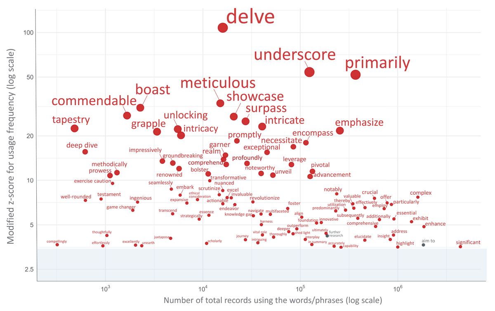

# Humanizer Academic

A Claude Code skill that removes signs of AI-generated writing from academic medical papers, making them sound more natural and professionally written.

## Installation

### Recommended (clone directly into Claude Code skills directory)

```bash
mkdir -p ~/.claude/skills
git clone https://github.com/matsuikentaro1/humanizer_academic.git ~/.claude/skills/humanizer_academic
```

### Manual install/update (only the skill file)

If you already have this repo cloned (or you downloaded `SKILL.md`), copy the skill file into Claude Code's skills directory:

```bash
mkdir -p ~/.claude/skills/humanizer_academic
cp SKILL.md ~/.claude/skills/humanizer_academic/
```

## Usage

In Claude Code, invoke the skill:

```
/humanizer_academic

[paste your manuscript text here]
```

Or ask Claude to humanize text directly:

```
Please humanize this academic text: [your text]
```

## Overview

Based on [Wikipedia's "Signs of AI writing"](https://en.wikipedia.org/wiki/Wikipedia:Signs_of_AI_writing) guide, adapted for medical and scientific literature. Examples are derived from the EMPA-REG OUTCOME trial publications and from the author's (K. Matsui) observations during academic manuscript editing.

### Key Insight from Wikipedia

> "LLMs use statistical algorithms to guess what should come next. The result tends toward the most statistically likely result that applies to the widest variety of cases."

## 31 Patterns Detected (with Before/After Examples)

### Content Patterns

| # | Pattern | Before | After |
|---|---------|--------|-------|
| 1 | **Significance inflation** | "represents a pivotal challenge in the evolving landscape" | "is highly prevalent in patients with diabetes" |
| 2 | **Notability claims** | "landmark trial, led by renowned investigators" | "A total of 7020 patients..." |
| 3 | **Superficial -ing analyses** | "highlighting the cardioprotective effects" | Report data without interpretation |
| 4 | **Promotional language** | "groundbreaking study showcases the profound impact" | "empagliflozin reduced heart failure hospitalization" |
| 5 | **Vague attributions** | "Studies have shown... Experts argue..." | "In the EMPA-REG OUTCOME trial..." |
| 6 | **Formulaic challenges** | "Despite challenges... future outlook" | State specific limitations |

### Language Patterns

| # | Pattern | Before | After |
|---|---------|--------|-------|
| 7 | **AI vocabulary** | "pivotal... landscape... crucial" | Remove or replace with simple words (note: "Additionally" is allowed once per paragraph) |
| 8 | **Copula avoidance** | "serves as... standing as... representing" | "is" |
| 9 | **Negative parallelisms** | "Not only X but also Y" | "X and Y" |
| 10 | **Rule of three** | "efficacy, safety, and tolerability" | Use natural number of items |
| 11 | **Synonym cycling** | "Patients... Participants... Subjects" | "Patients" (consistent terminology) |
| 12 | **False ranges** | "from renal function to cardiac outcomes" | List benefits directly |

### Style Patterns

| # | Pattern | Before | After |
|---|---------|--------|-------|
| 13 | **Em dash elimination (zero tolerance)** | "benefits—a 35% reduction—appeared early—" | Use commas, parentheses, or periods. ALL em dashes removed, no exceptions |
| 14 | **Title Case Headings** | "Statistical Analysis And Primary Endpoints" | "Statistical analysis and primary endpoints" |
| 15 | **Curly quotes** | \u201cclinically significant\u201d | "clinically significant" |

### Filler and Hedging

| # | Pattern | Before | After |
|---|---------|--------|-------|
| 16 | **Filler phrases** | "In order to", "Due to the fact that" | "To", "Because" |
| 17 | **Redundant multi-layered hedging** | "may suggest... have the potential to confer" | "suggest... may reduce" (keep 1-2 hedges) |
| 18 | **Generic conclusions** | "The future looks bright" | Specific findings and implications |

### LLM-Specific Word Choice Patterns (v1.1.0)

| # | Pattern | Before | After |
|---|---------|--------|-------|
| 19 | **"linked to" → "associated with"** (context-dependent) | "has been linked to shorter sleep duration" | "has been reported to be associated with" |
| 20 | **"Beyond" → "In addition to"** | "Beyond the association with..." | "In addition to the association with..." |
| 21 | **"via" → "through"** | "obtained via the online form" | "obtained through an online form" |
| 22 | **Insufficient hedging** | "may reduce the risk of..." | "may help reduce the risk of..." |
| 23 | **Artificially condensed expressions** | "fatigue–sleepiness cycle", "mutual reinforcement" | "cycle of fatigue and sleepiness", "a self-reinforcing cycle, with each behavior possibly exacerbating the other" |
| 24 | **"where" as a non-locative connector** | "...at the most intensive level, where almost daily use was..." | "...at the most intensive level, with almost daily use..." |
| 25 | **"yield" as a result verb** | "did not yield stable estimates" | "failed to produce stable estimates" |
| 26 | **Minor word-choice refinements** | "interpretations remain speculative", "speculative given the small sizes" | "interpretations are still speculative", "speculative due to the small sizes" |

### Cohesion and Connective Patterns (v1.1.4–1.3.0)

| # | Pattern | Before | After |
|---|---------|--------|-------|
| 27 | **Preserve logical discourse markers** + vary by relation (do NOT over-trim) | (aggressive removal of "Although / Whereas / Thus / Based on these results") | Keep connectives that make the logic explicit; vary them by relation (result / contrast / concession) only to avoid mechanical repetition, never for decoration |
| 28 | **Re-contextualize over-condensed semantic links** | "unmet needs to discuss their difficulties" | "unmet needs when it comes to discussing their difficulties" |
| 29 | **Ornamental -ly intensifier adverbs** | "markedly reduced", "critically important", "remarkably consistent" | Remove decorative intensifiers; keep functional ones ("slightly", "consistently", "approximately") |
| 30 | **Connective-preserving edits** (never bare-delete a transition) | "X reduced death. The benefit appeared within months." (choppy) | "X also reduced death, and this benefit appeared within months." |
| 31 | **Paragraph cohesion** (old-to-new flow + paragraph-opening markers) | Disconnected sentences after editing | Mandatory final check: each sentence links to the previous one; contrast/continuity openers (However / On the other hand / Overall / Taken together) survive |

### Preserved Academic Writing (do NOT flag as AI)

The skill explicitly **preserves** standard academic writing that was previously over-corrected:

- Transitional phrases: "Notably,", "Furthermore,", "In contrast,", etc.
- Logical discourse markers: "Although", "Whereas", "Thus", "Based on these results", "As expected", etc. (Pattern 27)
- Functional -ly adverbs: "slightly", "consistently", "modestly", "approximately" (Pattern 29)
- Interrogative sentence openers: "Who selects into...", "What predicts...", etc.
- "Additionally" up to once per paragraph (Pattern 7 exception)
- Attribution phrases with citations: "Prior studies have shown that...", "Evidence suggests that...", etc.

These are only flagged when used in excessive clusters or without supporting citations/data.

## Full Example

**Before (AI-sounding):**
> Heart failure represents a pivotal challenge in the evolving landscape of diabetes care, underscoring the critical importance of addressing cardiovascular comorbidities. This groundbreaking study showcases the profound impact of empagliflozin. Additionally, empagliflozin reduced the risk of hospitalization for heart failure or cardiovascular death by 34%—a remarkable finding—highlighting the cardioprotective effects of this intervention. The future looks bright for patients with type 2 diabetes.

**After (Humanized):**
> Heart failure is highly prevalent in patients with diabetes, occurring in more than one in five patients with type 2 diabetes aged over 65 years. In the EMPA-REG OUTCOME trial, empagliflozin reduced the risk of hospitalization for heart failure or cardiovascular death by 34%. The benefit was consistent in patients with and without heart failure at baseline.

## References

- [Wikipedia: Signs of AI writing](https://en.wikipedia.org/wiki/Wikipedia:Signs_of_AI_writing) - Primary source for AI writing patterns
- [WikiProject AI Cleanup](https://en.wikipedia.org/wiki/Wikipedia:WikiProject_AI_Cleanup) - Maintaining organization

### Examples Source

Medical paper examples (Patterns 1–18) are adapted from:

> Fitchett D, Inzucchi SE, Cannon CP, et al. Empagliflozin Reduced Mortality and Hospitalization for Heart Failure Across the Spectrum of Cardiovascular Risk in the EMPA-REG OUTCOME Trial. *Circulation*. 2019;139(11):1384-1395. doi:10.1161/CIRCULATIONAHA.118.037778

This article is published under [CC-BY-4.0](https://creativecommons.org/licenses/by/4.0/) license.

Examples for Patterns 19–31 are based on the author's (K. Matsui) observations during academic manuscript editing in sleep medicine research.

The AI-vocabulary patterns (Pattern 7) draw on the following papers that quantified words and phrases with increased or decreased frequency in post-ChatGPT medical and scientific writing:

> Matsui K. Delving into PubMed records: some terms in medical writing have drastically changed after the arrival of ChatGPT. *medRxiv*. 2025. doi:[10.1101/2024.05.14.24307373](https://doi.org/10.1101/2024.05.14.24307373)

> Matsui K. Delving Into PubMed Records: How AI-Influenced Vocabulary has Transformed Medical Writing since ChatGPT. *Perspect Med Educ*. 2025;14(1):882-890. doi:[10.5334/pme.1929](https://doi.org/10.5334/pme.1929)

> Bao T, Zhao Y, Mao J, et al. Examining linguistic shifts in academic writing before and after the launch of ChatGPT: a study on preprint papers. *Scientometrics*. 2025;130:3597-3627. doi:[10.1007/s11192-025-05341-y](https://doi.org/10.1007/s11192-025-05341-y)

> Galpin R, Anderson B, Juzek TS. Exploring the Structure of AI-Induced Language Change in Scientific English. *Int FLAIRS Conf Proc*. 2025;38. doi:[10.32473/flairs.38.1.138958](https://doi.org/10.32473/flairs.38.1.138958)

## Related Work by the Author

> Matsui K. Delving Into PubMed Records: How AI-Influenced Vocabulary has Transformed Medical Writing since ChatGPT. *Perspect Med Educ*. 2025 Dec 2;14(1):882-890. doi:[10.5334/pme.1929](https://doi.org/10.5334/pme.1929)

This is a paper I wrote. Using PubMed records, I measured how frequently LLMs such as ChatGPT tend to overuse certain words in medical writing. Take a look if you're curious!



*The image above is Figure 1 from the paper cited above, reproduced under the [CC-BY 4.0](https://creativecommons.org/licenses/by/4.0/) license.*

## Version History

- **1.3.1** - Extended Pattern 27 to vary connectives by logical relation (result / addition / contrast / concession / reason / sequence groups) to avoid mechanical repetition, with a guardrail against decorative connective-sprinkling (this is NOT an exception to Pattern 11).
- **1.3.0** - Added Pattern 29 (Ornamental -ly intensifier adverbs: remove decorative "markedly/critically/remarkably" while keeping functional adverbs such as "slightly/consistently/approximately"), Pattern 30 (Connective-preserving edits: never bare-delete a transition — replace or restructure to avoid choppy asyndeton), and Pattern 31 (Paragraph cohesion: a mandatory final check for old-to-new flow and surviving paragraph-opening markers). Relaxed Pattern 7 so "Additionally" is allowed once per paragraph (only excessive use is flagged).
- **1.2.x** - Reworked Pattern 26 into "Minor word-choice refinements" (remain → be-verb, given → due to); added Pattern 27 (Preserve logical discourse markers), Pattern 28 (Re-contextualize over-condensed semantic links), and context-dependent handling of "linked/associated" (Pattern 19). (The earlier "Underused Classical Academic Terms" pattern was retired during this restructuring; its vocabulary is now covered by Pattern 7 and the cited author papers.)
- **1.1.3** - Added patterns 24 ("where" as a non-locative connector) and 25 ("yield" as a result verb); added author paper reference and Fig.1 to README
- **1.1.2** - Pattern 13: Em dash rule upgraded to zero-tolerance elimination (no exceptions, mandatory final check step)
- **1.1.1** - Merged compressed noun-dash phrases and vague abstractions into single "Artificially condensed expressions" pattern (23)
- **1.1.0** - Added LLM-specific word choice patterns (19-23), preserved legitimate academic phrases, fixed hedging guidance consistency
- **1.0.0** - Initial release adapted for academic medical writing

## License

MIT

Based on [blader/humanizer](https://github.com/blader/humanizer).
