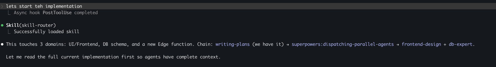
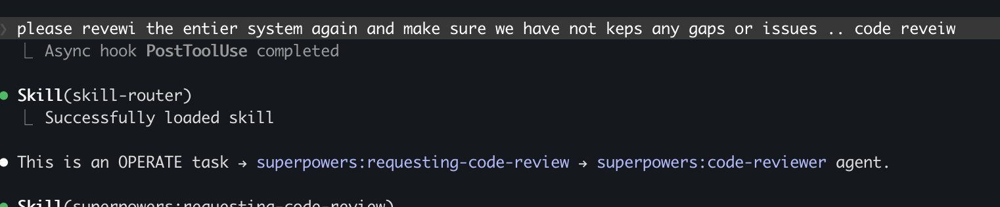

[← back to skill-router](../README.md) · [How it works →](./how-it-works.md) · [Customizing →](./customizing.md)

# Proof

Two unedited screenshots from real Claude Code sessions, captured 2026-04-27.
Same router, same install — different prompt shapes get different chain shapes.

> **Format note:** these screenshots predate the strict `[skill-router]`-prefixed announcement format. The current format prefixes every line, adds a `Models:` and `Thinking:` summary, and writes per-step `▶` lines so the chain is greppable from the transcript. See `SKILL.md` → "ANNOUNCEMENT FORMAT" for the live spec. The chain *content* the router computes for these prompts is unchanged.

## Multi-domain BUILD → 4-skill chain



**Typed:** `lets start teh implementation`

**Router output:**
> This touches 3 domains: UI/Frontend, DB schema, and a new Edge function.
> Chain: `writing-plans` → `superpowers:dispatching-parallel-agents` → `frontend-design` + `db-expert`.
>
> Let me read the full current implementation first so agents have complete context.

A 4-word, mostly-typo prompt — and the router still extracted that the work spanned three domains and announced the chain *before* touching code.

## Single-domain OPERATE → no chain



**Typed:** `please revewi the entier system again ... code reveiw`

**Router output:**
> This is an OPERATE task → `superpowers:requesting-code-review` → `superpowers:code-reviewer` agent.

No chain. No `brainstorming` ceremony. One skill, one agent — because the task fits a single path.

## Why this is the testable contract

The chain announcement fires *before* any `Skill` tool call. You can grep the transcript afterward and verify the actual tool calls match what was announced. That moves "agent picked the right tool" from vibe-check to measurement.

## Reproduce

```bash
mkdir -p ~/.claude/skills/skill-router
curl -sL https://raw.githubusercontent.com/hussi9/skill-router/main/SKILL.md \
  > ~/.claude/skills/skill-router/SKILL.md
```

Then ask Claude Code anything multi-domain ("add a settings page that writes to the DB and emails the user on save"). The chain announcement is the proof.
